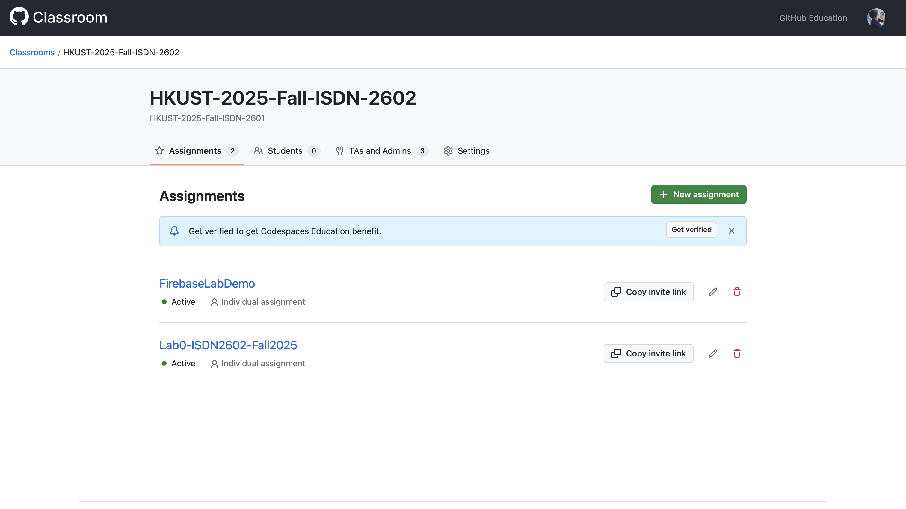
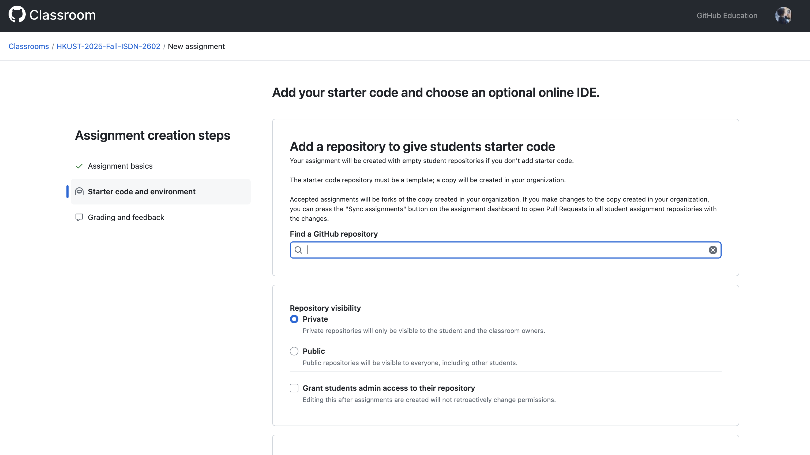
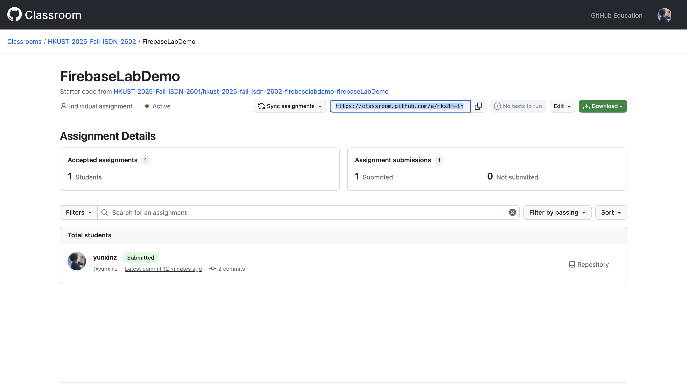
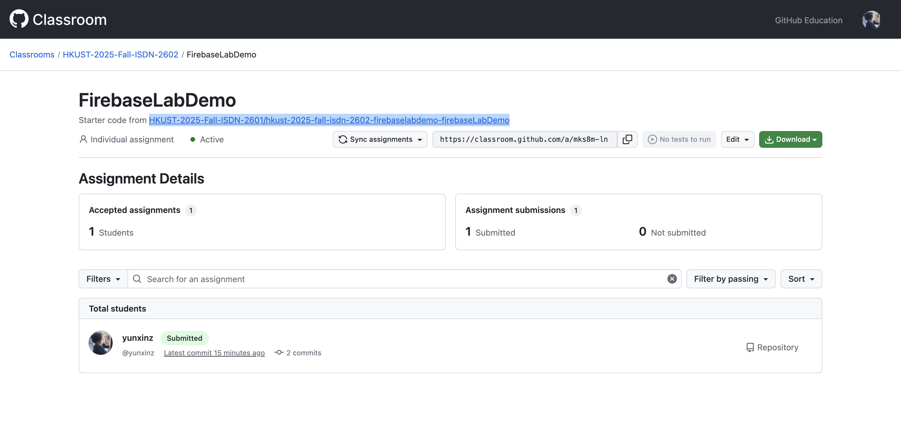
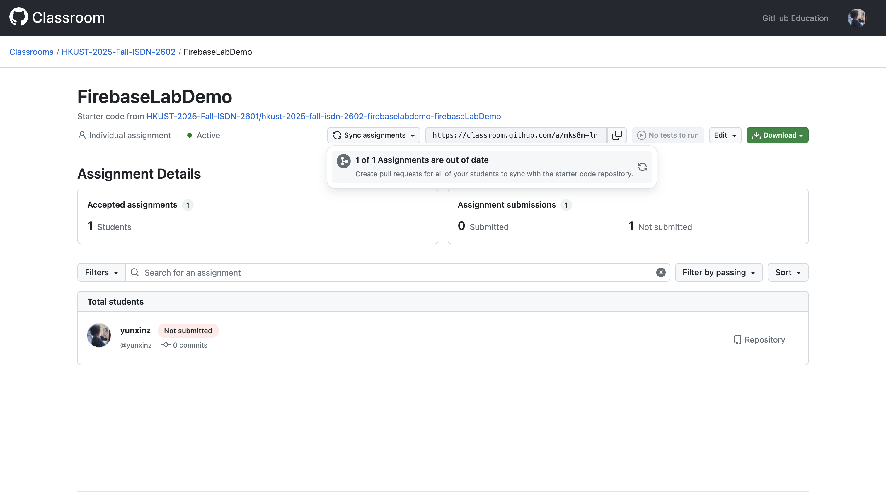

# Github Classroom

## Steps to Create a New Assignment
1. Click '+ New Assignment'

    Then give it a name, deadline (optional), and choose whether it is a group or individual assignment (individual by default)
    

2. Choose the starter code repo
    
    
    !!! note

        Make sure the repo should also be under our organization and it must be a template repo.
        
        You can go to the repo setting and check "Template repository" to make it a template.

3. Share the assignment invitation URL to students. Then they are good to go!
    

## Update Starter Code

If modification needs to be made to the starter code, go to the starter code repo 

==(NOT the original template repo !!!)==

Then make the changes to the starter code repo there

Check the assignment again after changes are made and pushed to the starter code repo, you will notice that the assignment is "Out of Date"

Then you can click sync to create a pull request to all students for them to update their code

On the student side, this is what they will see

If they click that notice, they can choose to merge the PR with new changes

If there's no conflict then they can just confirm the merge, new changes will be added to their code space

!!! warning

    If otherwise there are conflicts with their existing code, they need to resolve the conflicts themselves by choosing what to keep. This can be troublesome, so avoid modification to starter code and keep changelog for reference for students.