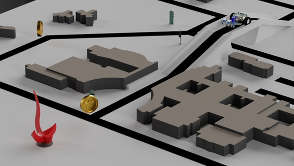

# Preview

### Callout preview
!!! note

    Lorem ipsum dolor sit amet, consectetur adipiscing elit. Nulla et euismod
    nulla. Curabitur feugiat, tortor non consequat finibus, justo purus auctor
    massa, nec semper lorem quam in massa.


!!! warning

    Lorem ipsum dolor sit amet, consectetur adipiscing elit. Nulla et euismod
    nulla. Curabitur feugiat, tortor non consequat finibus, justo purus auctor
    massa, nec semper lorem quam in massa.


!!! info

    Maybe we can put change log here
    
    Lorem ipsum dolor sit amet, consectetur adipiscing elit. Nulla et euismod
    nulla. Curabitur feugiat, tortor non consequat finibus, justo purus auctor
    massa, nec semper lorem quam in massa.

### Link test
[PDF Link](Assets/Lab1-Notes-2025Spring.pdf)

[Zip Download Link](Assets/demo-zip.zip)

### PDF embedded preview

<object data="Assets/Lab1-Notes-2025Spring.pdf" type="application/pdf">
    <embed style="width: 100%; height: 600px" src="Assets/Lab1-Notes-2025Spring.pdf" type="application/pdf"  />
</object>

    
### Image preview



Lorem ipsum dolor sit amet, consectetur adipiscing elit. Nulla et euismod nulla. Curabitur feugiat, tortor non consequat finibus, justo purus auctor massa, nec semper lorem quam in massa.

More information on how to style the image can be found here:
[MkDocs Material - Images](https://squidfunk.github.io/mkdocs-material/reference/images/)

### Code preview
``` py
import tensorflow as tf
```


### Table preview

| Method   | Description                          |
| -------- | ------------------------------------ |
| `GET`    | :material-check:     Fetch resource  |
| `PUT`    | :material-check-all: Update resource |
| `DELETE` | :material-close:     Delete resource |


### List preview

- Nulla et rhoncus turpis. Mauris ultricies elementum leo. Duis efficitur
  accumsan nibh eu mattis. Vivamus tempus velit eros, porttitor placerat nibh
  lacinia sed. Aenean in finibus diam.

    * Duis mollis est eget nibh volutpat, fermentum aliquet dui mollis.
    * Nam vulputate tincidunt fringilla.
    * Nullam dignissim ultrices urna non auctor.

- [ ] todo uncheck
- [x] todo checked


### Math Latex preview

$$
\cos x=\sum_{k=0}^{\infty}\frac{(-1)^k}{(2k)!}x^{2k}
$$

